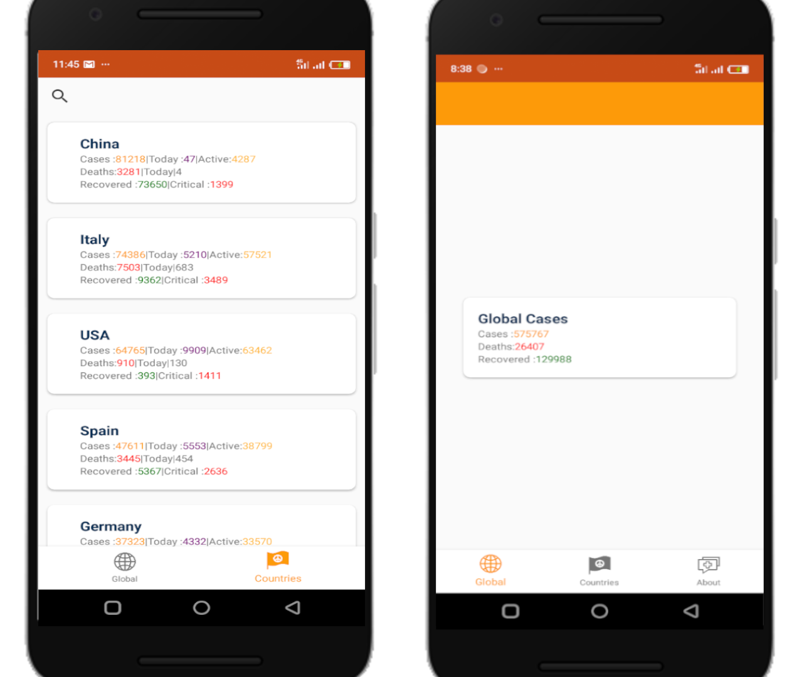

# COVID-19

Simple app to show all the COVID-19 cases globally

### Dependancies
- Kotlin dependancy injection [Kodein](https://kodein.org/di/)
- [Retrofit](https://square.github.io/retrofit/)
- [Kotlin coroutines](https://github.com/Kotlin/kotlinx.coroutines)
- [Android Room Persistence Library](https://developer.android.com/topic/libraries/architecture/room)
- [Android Navigation Architecture](https://developer.android.com/guide/navigation/navigation-getting-started)
- [DataBinding](https://developer.android.com/jetpack/androidx/releases/databinding)
- [View Model and Live Data](https://developer.android.com/jetpack/androidx/releases/lifecycle)

## Api
 Api for the currrent cases of COVID-19  https://corona.lmao.ninja/

## Mobile Preview

